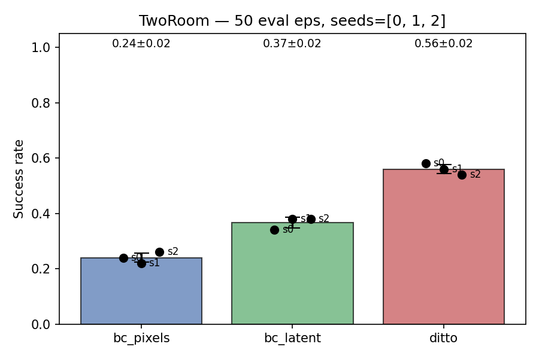

# Offline imitation learning inside JEPA World Model


A PyTorch implementation of **DITTO** — a policy learning method that combines world model imagination with behavioral cloning and reinforcement learning for visual control tasks.

## What This Is

- Implementation of the DITTO method ([DeMoss et al., 2023](https://arxiv.org/abs/2302.03086))
- Built upon [`stable-worldmodel`](https://github.com/jbinas/stable-worldmodel) library.

- Demonstrated on the Tworoom navigation environment


## Installation

### Option 1: Using `uv` (Recommended)

Fast and modern Python package manager:

```bash
# Clone repository
git clone https://github.com/Chiensaucisse/DITTO-JEPA
cd ditto-jepa

# Install in development mode with uv
uv pip install -e .

# Or install with dev dependencies
uv pip install -e ".[dev]"
```

### Option 2: Using `pip`

```bash
# Clone repository
git clone https://github.com/Chiensaucisse/DITTO-JEPA
cd ditto-jepa

# Install in development mode
pip install -e .

# Or install from requirements.txt
pip install -r requirements.txt
```

### Option 3: Using Conda

```bash
# Create environment
conda create -n ditto python=3.10
conda activate ditto

# Install dependencies
pip install -r requirements.txt
```

## Quick Start

### 1. Collect Data 

If you want to collect your own dataset using `uv`:

```bash
# Collect 100 trajectories 
uv run scripts/data/collect_custom.py --num-traj 100

# Collect with custom parameters
uv run scripts/data/collect_custom.py \
  --num-traj 1000 \
  --cache-dir ./datasets \
  --num-envs 20 \
  --action-noise 1.5
```

Or with `pip` (if installed):
```bash
python scripts/data/collect_custom.py --num-traj 100
```

### 2. Train World Model 

If you need a world model checkpoint, train LeWM:
```bash
uv run examples/train_lewm_tworoom.py
```

Or use a pre-trained checkpoint.

### 3. Train DITTO Policy

```bash
uv run examples/train_ditto_tworoom.py
```

### 4. Evaluate Policy

```bash
uv run examples/eval_pretrained.py \
  --checkpoint ./checkpoints/ditto_tworoom_100_ditto_0.pth \
  --num-evals 10
```

## Training Methods

### Behavioral Cloning (BC)
- **`bc_pixels`**: Learn directly from raw pixels
- **`bc_latent`**: Learn in world model's latent space

### DITTO (Behavioral Cloning + RL)
- **`ditto`**: Actor-Critic learning with:
  - Value loss from imagined rollouts
  - Behavioral cloning auxiliary loss (optional)
  - Entropy regularization for exploration


## Results

### Benchmark Comparison (TwoRoom, 50 eval episodes)

Success rates comparison across three training methods with 3 different random seeds:



- **bc_pixels**: 24% ± 2% - Learning directly from pixels
- **bc_latent**: 37% ± 2% - Behavioral cloning in latent space  
- **ditto**: 56% ± 2% - DITTO with actor-critic and world model imagination

### Training Visualization

Example of agent navigation in the TwoRoom environment:

<video src="results/ditto.mp4" width="224" controls></video>

## Code Organization

### Key Files Explained

**`ditto/models.py`**
- Neural network architectures for actor, critic, and encoders

**`ditto/interfaces.py`**
- Abstraction layer for world model interaction
- `LeWMInterface` class for encoding episodes and stepping through the model


**`ditto/training.py`**
- Training loops for different methods (BC, DITTO)
- Imagination rollout with world model
- Generalized Advantage Estimation return computation

**`ditto/evaluation.py`**
- Policy rollout in actual environment
- Video generation with goal visualization
- Success rate metrics

**`ditto/utils.py`**
- Configuration management
- Loss utilities
- Hyperparameter definitions

**`scripts/data/collect_custom.py`**
- Data collection from TwoRoom environment
- Creates expert trajectories in swm data formats
- Configurable noise, action repeats, and trajectory count
- Use: `python scripts/data/collect_custom.py --num-traj 100 --cache-dir /path/data_folder/`


## Extending the Code

### Adding a Custom World Model

Create a new interface by subclassing the base pattern:

```python
# ditto/interfaces.py
class CustomWMInterface:
    def __init__(self, wm, history_size: int):
        self.wm = wm
        self.history_size = history_size
    
    @property
    def embed_dim(self):
        return self.wm.embedding_dim
    
    def encode_episode(self, batch):
        # Your encoding logic
        return embeddings, actions
    
    def encode_state(self, pixels):
        # Encode single frame
        return embedding
    
    def init_context(self, expert_emb, expert_act):
        # Initialize rollout context
        return context
    
    def step(self, ctx, action):
        # Predict next state
        return updated_context, next_embedding
```

### Custom reward signal

Modify training loops in `ditto/training.py` to experiment with different reward signals:

```python
# In imagine_rollout(), replace:
r = max_cos(s_next, s_next_expert)

# With custom reward:
r = custom_reward_function(s_next, s_next_expert, ...)
```


## Citation

The original DITTO paper:

```bibtex
@article{demoss2023ditto,
  title={Ditto: Offline imitation learning with world models},
  author={DeMoss, Benjamin and Duckworth, Paul and Foerster, Jakob and Hawes, Nick and Posner, Ingmar},
  journal={arXiv preprint arXiv:2302.03086},
  year={2023}
}
```


## Acknowledgments

- Built on top of [stable-worldmodel](https://github.com/jbinas/stable-worldmodel)
- Vision backbones from [Hugging Face transformers](https://huggingface.co/models)
